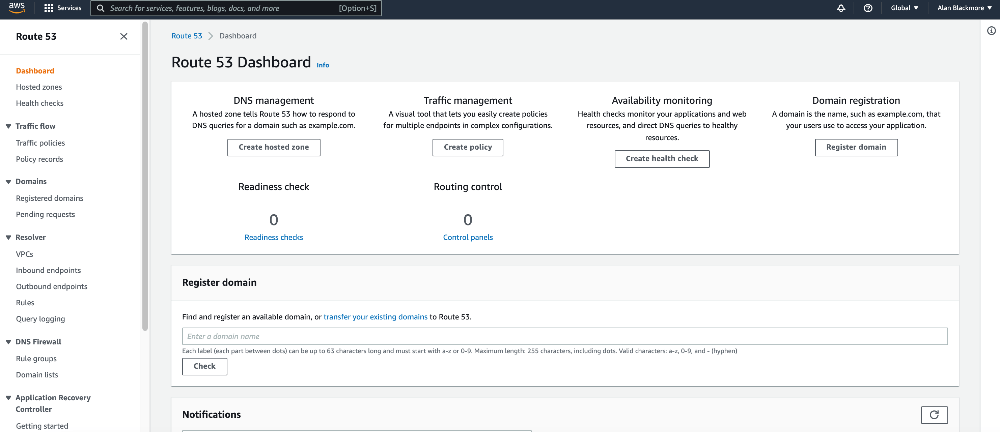
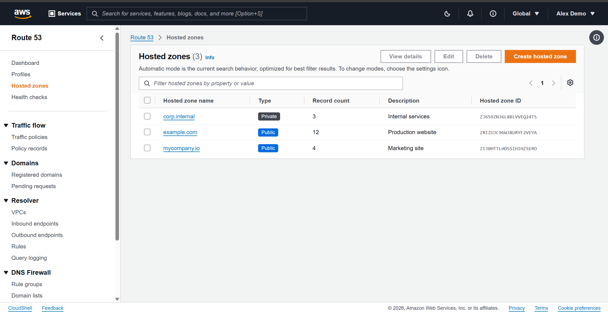
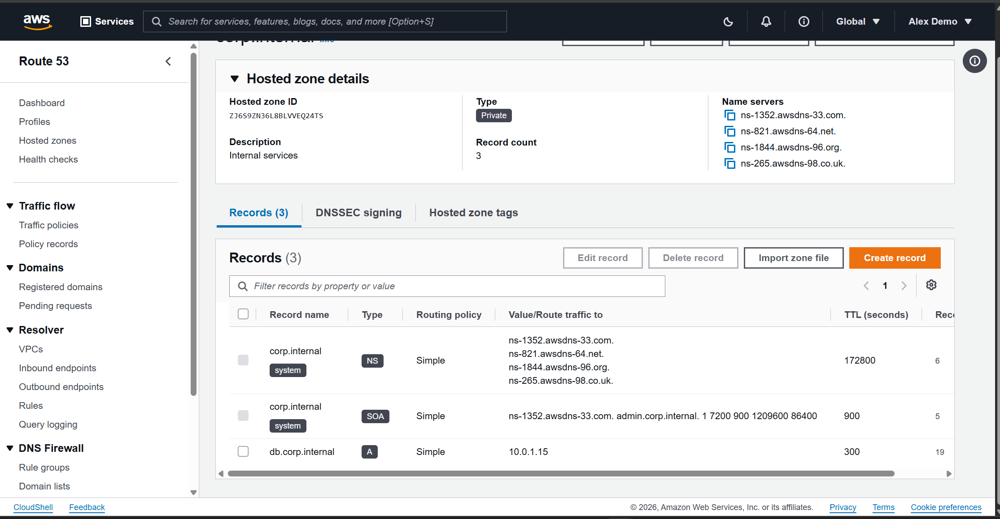
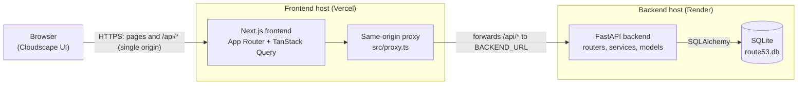
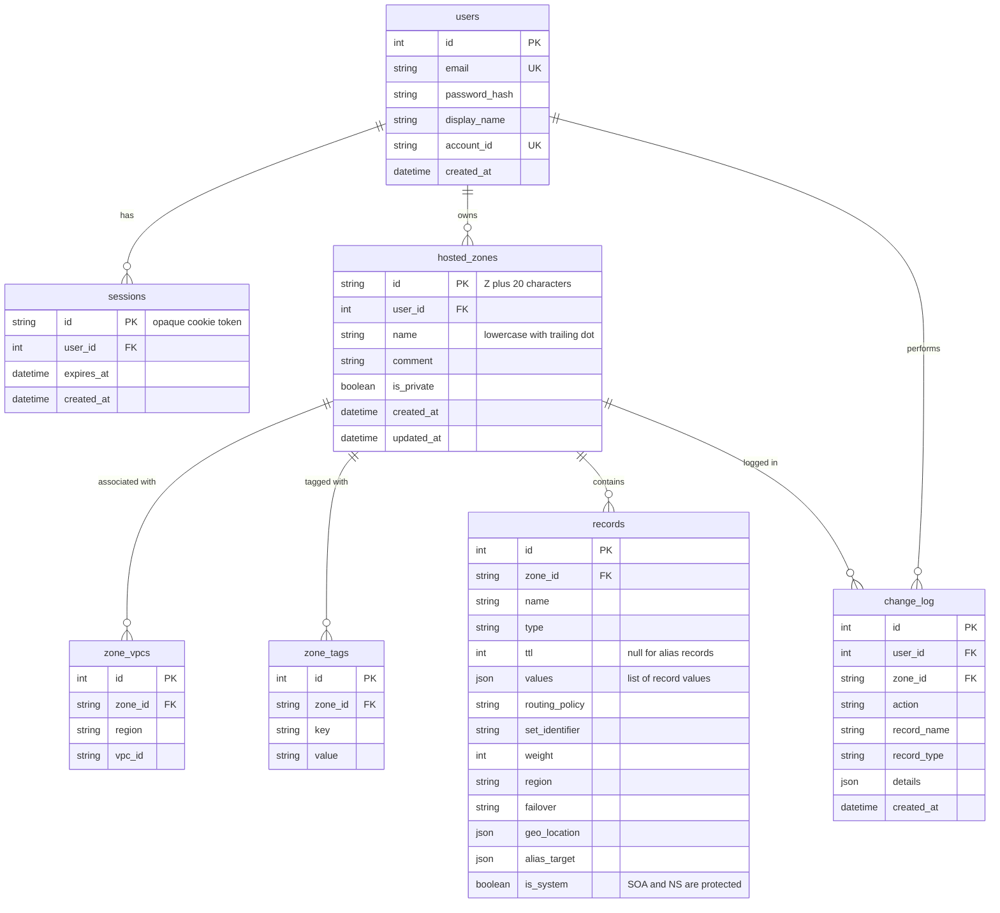

# AWS Route 53 Console Clone

A pixel-faithful clone of the **AWS Route 53 management console**: web UI only, no real DNS. It reproduces the classic
console look (grey page, square outlined buttons, orange primary and active colours, blue "Info" links) with the
Cloudscape Design System. It is backed by a FastAPI service that enforces Route 53's real rules: hosted zone IDs,
automatic SOA/NS records, per-type record validation, CNAME exclusivity, routing policies, private zones with VPCs,
and more.

- **Live demo:** <https://aws-route-53-clone-tan.vercel.app>
- **Demo login:** `demo@example.com` / `demo1234`

The demo account comes with three hosted zones (`example.com`, `mycompany.io` and a private `corp.internal`) and a
dozen sample records covering every supported record type.

**Contents:** [Screenshots](#screenshots) · [Quick start](#quick-start) · [Configuration](#configuration) ·
[Architecture overview](#architecture-overview) · [Database schema](#database-schema) · [API overview](#api-overview) ·
[Features](#features) · [Keyboard shortcuts](#keyboard-shortcuts) · [Known limitations](#known-limitations) ·
[Project layout](#project-layout)

## Screenshots

The reference screenshots of the real console that the UI was built against are in [`docs/reference/`](docs/reference/).

### Dashboard



### Hosted zones list



### Hosted zone records view



## Quick start

### Option A: Docker Compose (one command)

Requires Docker with Compose v2.

```bash
docker compose up --build
```

Then open <http://localhost:3000> and sign in with the demo login above. On every start the backend runs its
migrations and seeds the demo data (both are idempotent). Data lives in the `route53-data` volume;
`docker compose down -v` wipes it.

| Service | URL |
| --- | --- |
| App (Next.js) | <http://localhost:3000> |
| API and Swagger docs (FastAPI) | <http://localhost:8000/docs> |

### Option B: run the two services manually

Requires Python 3.11+ and Node.js 20+.

**Backend** (terminal 1):

```bash
cd backend
python -m venv .venv
.venv\Scripts\activate            # macOS/Linux: source .venv/bin/activate
pip install -r requirements.txt
alembic upgrade head              # creates data/route53.db
python -m app.seed                # demo user + sample zones/records (safe to re-run)
set COOKIE_SECURE=false           # macOS/Linux: export COOKIE_SECURE=false  (or put it in backend/.env)
uvicorn app.main:app --reload --port 8000
```

`COOKIE_SECURE=false` is needed because local development uses plain HTTP; see [Configuration](#configuration).

**Frontend** (terminal 2):

```bash
cd frontend
npm install
npm run dev                       # http://localhost:3000
```

The frontend forwards `/api/*` to the backend at `BACKEND_URL` (default `http://localhost:8000`; see
`frontend/.env.example`). Sign in at <http://localhost:3000> with the demo login.

### Running the tests

```bash
cd backend && pytest              # 68 tests: auth, zones, records, validation, import/export
cd frontend && npm run build && npm run lint
```

## Configuration

Backend settings are environment variables (or `backend/.env`; copy `backend/.env.example`). The frontend has one.

| Variable | Service | Default | Purpose |
| --- | --- | --- | --- |
| `DATABASE_URL` | backend | `sqlite:///./data/route53.db` | Database location (`sqlite:////data/route53.db` in Docker) |
| `SESSION_TTL_HOURS` | backend | `8` | Login session lifetime |
| `COOKIE_SECURE` | backend | `true` | `Secure` flag on the session cookie. **Keep `true` in production (HTTPS).** Set `false` for plain-HTTP local development; `docker-compose.yml` already does |
| `CORS_ORIGINS` | backend | `["http://localhost:3000"]` | Allowed origins if the API is called cross-origin (not needed through the proxy) |
| `BACKEND_URL` | frontend | `http://localhost:8000` | Where the Next.js proxy forwards `/api/*`; read at runtime, so set it on the frontend host in production |

## Architecture overview

The app is three tiers. The browser only ever talks to the Next.js frontend; Next.js forwards every `/api/*` request
to the FastAPI backend, which reads and writes a SQLite database.



Locally the same picture applies with the frontend on `:3000`, the backend on `:8000` and the SQLite file on disk (or
in the Docker volume).

1. **Presentation: Next.js, TypeScript and Cloudscape.** Pages talk to the API through a typed fetch wrapper
   (`lib/api-client.ts`) and TanStack Query; forms use React Hook Form and Zod.
2. **API: FastAPI.** Strictly layered: `routers/` parse and return, `services/` hold every business rule,
   `models/` are SQLAlchemy 2.0 models and `schemas/` are Pydantic v2 models. All routes live under `/api/v1`, and
   every error has the shape `{"error": {"code": "<Route53StyleCode>", "message": "..."}}`.
3. **Data: SQLite** via SQLAlchemy, with Alembic migrations.

**Same-origin by design.** The browser never calls the backend directly. `src/proxy.ts` forwards `/api/*` to
`BACKEND_URL` (read at runtime, so one built image works anywhere). This keeps the `session` cookie (`httpOnly`,
`SameSite=Lax`, `Secure` in production) same-origin and avoids CORS.

**Auth is mocked but realistic.** There are `users` and `sessions` tables, bcrypt password hashes, an opaque session
token in a cookie, and a `get_current_user` dependency on every route except login and health. All data is scoped to
the signed-in user, so one user cannot read or change another user's zones.

## Database schema



| Table | Purpose | Key columns |
| --- | --- | --- |
| `users` | Accounts for the mock sign-in | `email` (unique), `password_hash`, `display_name`, `account_id` (fake 12-digit) |
| `sessions` | Server-side login sessions | `id` (cookie token), `user_id` → users, `expires_at` |
| `hosted_zones` | Public and private hosted zones | `id` (`Z` + 20 chars), `user_id`, `name` (lowercase, trailing dot), `comment`, `is_private` |
| `zone_vpcs` | VPCs associated with private zones | `zone_id` → hosted_zones, `region`, `vpc_id`; unique per zone |
| `zone_tags` | Key/value tags on a zone | `zone_id` → hosted_zones, `key`, `value`; one value per key per zone |
| `records` | DNS record sets, including the system SOA/NS | `zone_id`, `name`, `type`, `ttl`, `values` (JSON list), `routing_policy`, `set_identifier`, `weight`/`region`/`failover`/`geo_location`, `alias_target` (JSON), `is_system` |
| `change_log` | Audit trail of zone changes | `user_id`, `zone_id`, `action`, `record_name`, `record_type`, `details` (JSON) |

Notes:
- Deleting a user cascades to their sessions, zones and log entries, and deleting a zone cascades to its VPCs, tags,
  records and log entries.
- `records` is unique on `(zone_id, name, type, set_identifier)`. `set_identifier` is stored as `""` for simple
  records so the constraint covers them too.
- `change_log` is part of the schema, but nothing writes to it yet.

## API overview

Interactive docs (Swagger UI) are served by the backend at **<http://localhost:8000/docs>** (or `/docs` on the
deployed backend). All routes are prefixed with `/api/v1`.

| Group | Endpoints | What it does |
| --- | --- | --- |
| Auth | `POST /auth/login`, `POST /auth/logout`, `GET /auth/me` | Cookie-based mock sign-in, sign-out, current user |
| Hosted zones | `GET/POST /hostedzones`, `GET/PATCH/DELETE /hostedzones/{id}`, `POST /hostedzones/bulk-delete` | List (search, type filter, sort, pagination), create public or private zones, edit description and VPCs, delete (blocked with `HostedZoneNotEmpty` while user records exist), bulk delete |
| Tags | `GET/PUT /hostedzones/{id}/tags` | Read and replace a zone's tags |
| Records | `GET/POST /hostedzones/{id}/records`, `GET/PUT/DELETE …/records/{rid}`, `POST …/records/bulk-delete` | List with search and type/routing filters, create one record or an atomic batch, edit, delete, bulk delete; per-type value validation |
| Import / export | `POST /hostedzones/{id}/import?dry_run=`, `GET /hostedzones/{id}/export?format=json\|bind` | Preview or apply a BIND zone file (or JSON export); download a zone as JSON or BIND |
| Health | `GET /health` | Liveness check (no auth) |

## Features

**Console shell**
- AWS-style top navigation (search box, region, account menu, sign out) and the full Route 53 side navigation
- Breadcrumbs on every page, Flashbar notifications for every success and failure, and a confirmation dialog (type
  `delete`) for every deletion
- "Coming soon" pages for the areas this demo doesn't implement (see [Known limitations](#known-limitations)) and
  styled 404 pages

**Dashboard.** The Route 53 dashboard with its feature cards, domain-registration box and notifications panel.

**Hosted zones**
- Searchable, paginated list with page-size preferences and public/private badges
- Create public or private zones (private zones need at least one VPC, picked from a region-filtered list)
- Edit description, VPCs and tags; delete one or many
- Details page: zone info, the four generated name servers (with copy buttons), and Records, DNSSEC and Tags tabs

**DNS records**
- Types: A, AAAA, CNAME, TXT, MX, NS, PTR, SRV and CAA, plus the protected SOA and NS records created with every zone
- Property filter (name, type, routing policy), pagination, and locked system records
- Create form with a name suffix, per-type hints, alias toggle, TTL presets, **"Add another record"** batch creation
  (all-or-nothing) and routing policies: simple, weighted, latency, failover, geolocation and multivalue
- Validation on both client and server: IPv4/IPv6, hostnames, MX/SRV/CAA formats, CNAME exclusivity, duplicate detection

### Bonus features

- **BIND zone file import:** paste or upload a file, preview what would be created and what would be skipped (with
  line numbers and reasons), then import. A JSON export is accepted too.
- **Export:** download any zone as JSON or BIND format.
- **Dark mode:** toggle in the top bar; remembered across visits and applied before first paint (no flash).
- **Keyboard shortcuts:** see the next section.
- **Bulk operations:** multi-select delete for hosted zones and records, with a per-item success/failure summary.

## Keyboard shortcuts

Active on the hosted zones list and the records tab. They are ignored while you type in a field or while a dialog is open.

| Key | Action |
| --- | --- |
| `/` | Focus the search / filter box |
| `c` | Create (hosted zone, or record when viewing a zone) |
| `e` | Edit the selected item (when exactly one is selected) |
| `Delete` | Delete the selected items |
| `r` | Refresh the current list |
| `?` | Show the shortcuts help dialog |

## Known limitations

- **No real DNS.** Nothing is resolved, delegated or served; the "name servers" are generated fakes.
- **Routing policies are stored, not evaluated.** Weighted, latency, failover, geolocation and multivalue records
  save and validate their fields, but nothing routes traffic, and health checks aren't implemented.
- **The BIND parser covers common cases**, not the full RFC: the record types above, `$ORIGIN`/`$TTL`, comments,
  multi-line parentheses and blank owners. `$INCLUDE`, `$GENERATE`, other record types, and SOA and apex NS lines are
  skipped with a reason.
- **Alias records** only offer a DNS name and a health toggle; the alias target's hosted zone ID is set to the current zone.
- **Mock authentication:** no sign-up, password reset or roles.
- **Placeholder pages:** Profiles, Health checks, Traffic flow (traffic policies, policy records), Domains,
  Resolver, DNS Firewall and Application Recovery Controller show a "Coming soon" page.
- `change_log` exists in the schema but is not written to yet.

## Project layout

```
backend/    FastAPI app (app/routers, services, models, schemas), Alembic migrations, tests, Dockerfile
frontend/   Next.js app (src/app pages, src/components, src/hooks, src/lib), Dockerfile
docs/       PLAN.md (the build phases) and reference screenshots of the real console
docker-compose.yml
```

See [`docs/PLAN.md`](docs/PLAN.md) for the build phases.
